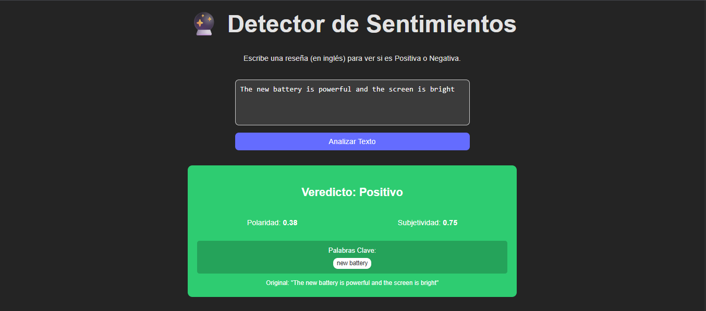

# 🔮 Sentiment Analyzer - Full Stack AI App

Una aplicación web moderna que utiliza **Procesamiento de Lenguaje Natural (NLP)** para analizar reseñas de usuarios en tiempo real. Detecta polaridad (positivo/negativo), subjetividad y extrae palabras clave mediante una arquitectura de microservicios.


## 📸 Demo

Así se ve la aplicación analizando un comentario positivo:


*Análisis de sentimiento con detección de palabras clave y polaridad.*

## 🚀 Tecnologías (The "Holy Trinity")

Este proyecto implementa una arquitectura desacoplada para demostrar habilidades Full Stack y Data Science:

* **Frontend:** React (Vite) + CSS Modules.
* **Backend Orchestrator:** Node.js (Express) - Gestiona peticiones y seguridad.
* **AI Microservice:** Python (FastAPI + TextBlob) - Motor de análisis de datos.

## 🏗️ Arquitectura

El flujo de datos sigue un patrón de microservicios:

```mermaid
graph TD
    User[Usuario] --> Front[React Frontend]
    Front -->|HTTP POST| Node[Node.js Server]
    Node -->|HTTP POST| Py[Python AI Service]
    Py -->|JSON Analysis| Node
    Node -->|JSON Result| Front
    Front -->|Visual Feedback| User

✨ Funcionalidades
Análisis de Sentimiento: Clasifica textos en Positivo, Negativo o Neutro.

Detección de Subjetividad: Distingue entre hechos objetivos y opiniones personales.

Extracción de Keywords: Identifica los tópicos principales (Sustantivos) de la reseña.

UI Reactiva: Interfaz visual con retroalimentación de color y medidores dinámicos.

Blindaje de Errores: Manejo robusto de fallos de conexión entre servicios.

🚧 Roadmap (Próximos Pasos)
El proyecto está en desarrollo activo. Estas son las funcionalidades planificadas para las siguientes versiones:

[ ] Soporte Multi-idioma: Integrar traducción automática o modelos NLP para español.

[ ] Base de Datos: Persistencia de análisis históricos usando SQLite/PostgreSQL.

[ ] Autenticación: Login de usuarios para guardar historiales personales.

[ ] Deploy: Despliegue en la nube (Render/Vercel/AWS).

[ ] Mejoras UI: Modo oscuro y gráficos estadísticos avanzados.

📂 Estructura del Proyecto
Bash

sentiment-analyzer-fullstack/
├── ai-service/        # Microservicio Python (FastAPI + TextBlob)
│   ├── main.py        # Lógica de NLP y Endpoints
│   └── requirements.txt
├── backend/           # API Gateway (Node.js + Express)
│   └── server.js      # Orquestación de servicios
├── frontend/          # UI (React + Vite)
│   ├── src/
│   └── package.json
├── screenshots/       # Imágenes para documentación
│   └── demo-result.png
└── README.md
📦 Instalación y Ejecución
Como es un proyecto de múltiples servicios, se requiere levantar cada parte por separado.

1. Clonar el repositorio
Bash

git clone [https://github.com/UriCapdevila/sentiment-analyzer-fullstack.git](https://github.com/UriCapdevila/sentiment-analyzer-fullstack.git)
cd sentiment-analyzer-fullstack
2. Servicio de IA (Python)
Bash

cd ai-service
python -m venv venv
# Windows: venv\Scripts\activate  |  Mac/Linux: source venv/bin/activate
pip install fastapi uvicorn textblob
python -m textblob.download_corpora
python -m uvicorn main:app --reload
# Corre en puerto 8000
3. Backend (Node.js)
En una nueva terminal:

Bash

cd backend
npm install
node server.js
# Corre en puerto 3000
4. Frontend (React)
En una nueva terminal:

Bash

cd frontend
npm install
npm run dev
# Corre en puerto 5173 (generalmente)
🧪 Ejemplo de uso (JSON Response)
El servicio de Python devuelve un análisis detallado:

JSON

{
  "analysis": {
    "score": 0.75,
    "subjectivity": 0.8,
    "label": "Positivo",
    "keywords": ["user interface", "performance"]
  },
  "original_text": "I love the user interface and the performance is great."
}
👤 Autor
Uriel Capdevila Desarrollador Full Stack & Data Scientist