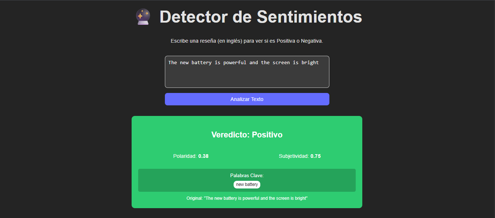

# Sentiment Analyzer - Full Stack AI App

Aplicacion fullstack para analizar feedback de usuarios con NLP. El objetivo es evolucionarla desde un detector basico de sentimientos hacia una plataforma de insights para resenas, comentarios y feedback de producto.


## Demo



## Propuesta de valor

El proyecto permite enviar una resena, procesarla con un microservicio de IA y devolver:

- sentimiento: positivo, negativo o neutro
- polaridad numerica
- subjetividad
- palabras clave detectadas

El siguiente paso natural es convertir esos analisis individuales en historial, tendencias, temas frecuentes y recomendaciones accionables.

## Arquitectura

Arquitectura local actual:

```text
Usuario
  -> React + Vite
  -> Node.js + Express API Gateway
  -> Python + FastAPI AI Service
  -> TextBlob NLP
```

Arquitectura objetivo para el MVP SaaS en Cloudflare:

```text
Cloudflare Pages
  -> Cloudflare Worker API
  -> Cloudflare AI Gateway
  -> Google Gemini API
  -> Cloudflare D1
```

### Servicios

- `frontend`: interfaz React.
- `backend`: API Gateway en Express. Valida input, aplica CORS, llama al servicio de IA y normaliza errores.
- `ai-service`: microservicio FastAPI con TextBlob.
- `cloudflare-worker`: API cloud serverless para analizar feedback, persistir historial y exponer insights.

## Endpoints

Backend:

- `GET /health`: estado del gateway.
- `POST /api/review`: analiza una resena.

AI service:

- `GET /health`: estado del servicio de IA.
- `POST /analyze`: analiza texto y devuelve el resultado NLP.

## Respuesta de ejemplo

```json
{
  "analysis": {
    "score": 0.75,
    "subjectivity": 0.8,
    "label": "Positivo",
    "keywords": ["user interface", "performance"]
  },
  "original_text": "I love the user interface and the performance is great."
}
```

## Instalacion

### 1. AI service

```bash
cd ai-service
python -m venv venv
venv\Scripts\activate
pip install -r requirements.txt
python -m textblob.download_corpora
python -m uvicorn main:app --reload
```

El servicio corre por defecto en `http://127.0.0.1:8000`.

Variables opcionales para usar un LLM como motor principal:

```bash
copy .env.example .env
```

```env
ANALYSIS_PROVIDER=auto
GEMINI_API_KEY=
GEMINI_MODEL=gemini-3.5-flash
OPENAI_API_KEY=
OPENAI_MODEL=gpt-5.5
LLM_TIMEOUT_SECONDS=25
```

Proveedores disponibles:

- `auto`: usa Gemini si existe `GEMINI_API_KEY`; si no, usa OpenAI si existe `OPENAI_API_KEY`; si no hay key o falla el proveedor, vuelve al analizador local.
- `gemini`: fuerza Gemini API.
- `openai`: fuerza OpenAI API.
- `local`: fuerza TextBlob + reglas de producto.

Para prototipos con Gemini Free, usa solo datos ficticios, anonimizados o resenas publicas. Para datos reales de clientes, conviene pasar a un plan/proveedor con compromiso de no usar contenido para mejorar productos.

### 2. Backend

```bash
cd backend
npm install
copy .env.example .env
npm run dev
```

Variables disponibles:

```env
PORT=3000
AI_SERVICE_URL=http://127.0.0.1:8000
AI_TIMEOUT_MS=5000
MAX_TEXT_LENGTH=5000
CORS_ORIGIN=http://localhost:5173,http://127.0.0.1:5173
```

### 3. Frontend

```bash
cd frontend
npm install
copy .env.example .env
npm run dev
```

Variable disponible:

```env
VITE_API_URL=http://localhost:3000
```

Para probar contra el Worker desplegado, `VITE_API_URL` debe apuntar al dominio del Worker o a la ruta conectada en Cloudflare Pages.

### 4. Cloudflare Worker

```bash
cd cloudflare-worker
npm install
copy .dev.vars.example .dev.vars
npm run cf-typegen
npm run db:migrate:local
npm run dev
```

Ver detalles de D1, secrets y deploy en `cloudflare-worker/README.md`.

## Roadmap recomendado

### Fase 1: base seria

- configuracion por entorno
- health checks
- validacion de input
- timeouts entre servicios
- errores consistentes
- dependencias reproducibles

### Fase 2: producto

- persistencia con SQLite o PostgreSQL
- historial de analisis
- dashboard con metricas
- paginacion y filtros
- tests de backend, AI service y frontend

### Fase 3: IA mejorada

- deteccion de idioma
- soporte real para espanol
- clasificacion por categorias: soporte, precio, UX, performance
- resumen de insights
- comparacion historica por periodo

### Fase 4: produccion

- Docker Compose
- rate limiting
- logs estructurados
- request IDs
- CI con lint, build y tests
- deploy en Vercel/Cloudflare + Render/Fly/Railway

## Autor

Uriel Capdevila - Full Stack Developer & Data Science enthusiast
